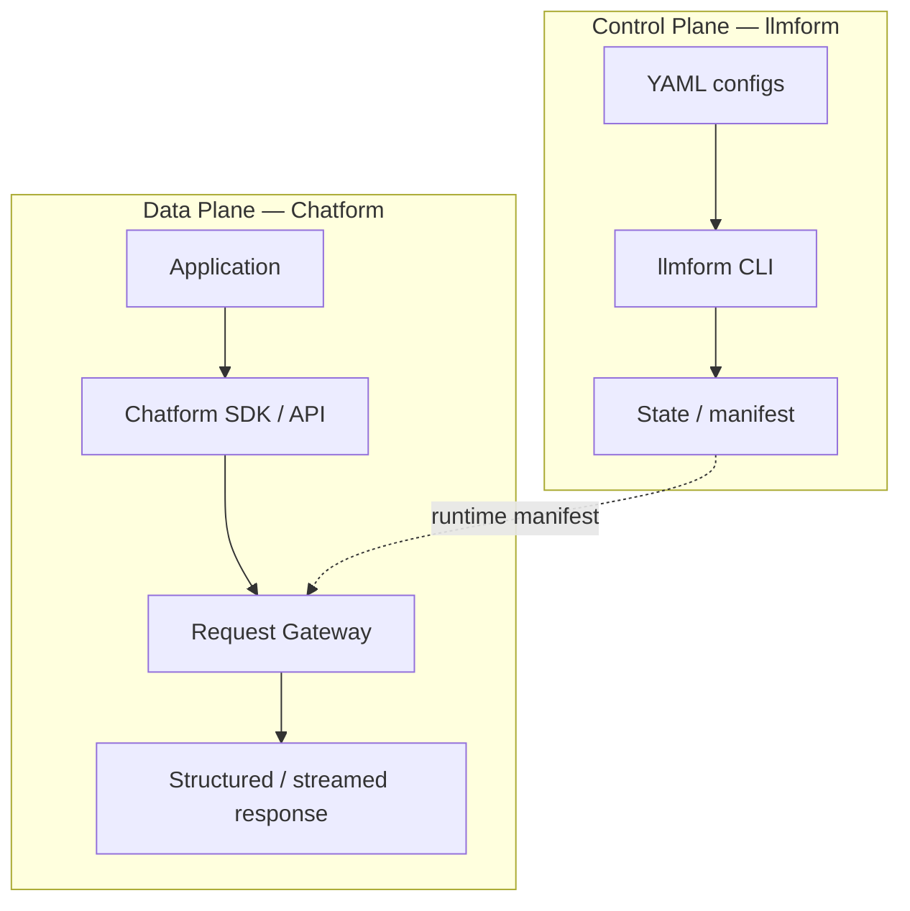
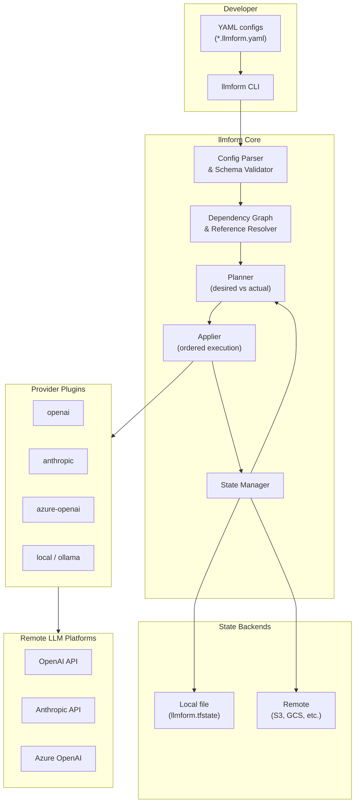
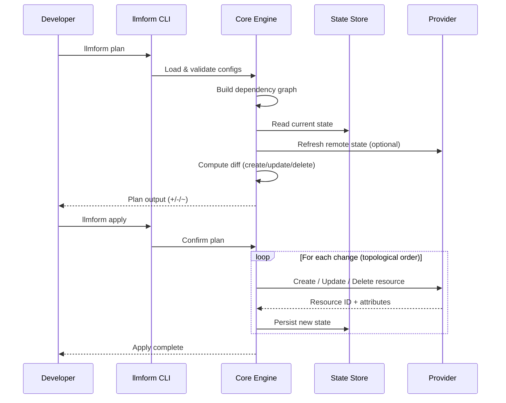
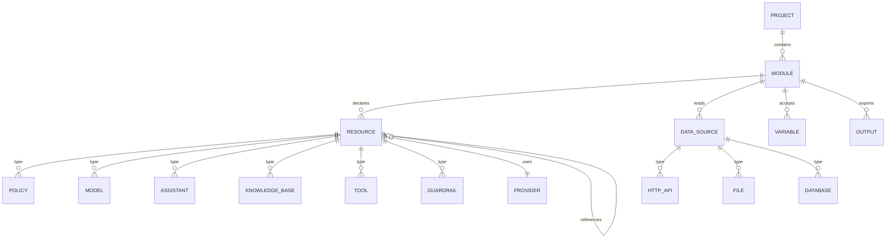
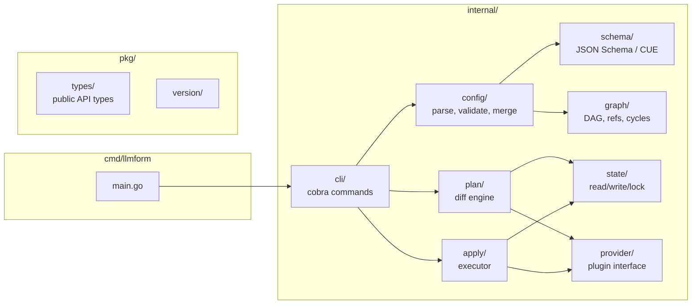

# llmform Architecture

> **⚠️ SUPERSEDED — do not build from this document.**
> The provisioner design described here (state file, `apply`/`destroy`/`import`,
> remote resource IDs) was abandoned on 2026-08-23. Its `policy` resource means
> *prompt fragment*, which is the opposite of what `policy` means in the current design.
> Retained only as a record of the rejected approach.
> **Current spec: [SPEC.md](./SPEC.md). Rationale: [DESIGN-REVIEW.md](./DESIGN-REVIEW.md).**

**llmform** is declarative infrastructure-as-code for LLM stacks. You describe the desired state in YAML; llmform validates it, plans changes, and applies them to providers (OpenAI, Anthropic, etc.).

Inspired by Terraform's workflow: **init → validate → plan → apply → destroy**.

> **Two-plane model:** llmform is the **control plane** (config, plan, apply). **Chatform** is the **data plane** (SDK/API + Request Gateway that executes live requests). See [RUNTIME.md](./RUNTIME.md) for the full gateway pipeline.

---

## Control Plane vs Data Plane



---

## High-Level System Diagram



---

## Plan / Apply Workflow



---

## Configuration Model

Configs are organized into **modules** (directories) with a root `llmform.yaml` and optional child files.



### Resource Types (v1)

| Type | Purpose | Example |
|------|---------|---------|
| `policy` | System prompts, behavior rules, safety constraints | "Always cite sources" |
| `model` | Model selection, parameters (temperature, max_tokens) | `gpt-4o`, `claude-sonnet-4` |
| `data_source` | Where context/data is pulled from | REST API, S3, Postgres |
| `tool` | Callable functions / MCP integrations | `search`, `calculator` |
| `guardrail` | Input/output filters, PII redaction, topic blocks | Block medical advice |
| `assistant` | Composed stack: model + policies + tools + data | Customer support bot |
| `knowledge_base` | RAG corpus wired to embeddings + vector store | Product docs index |

### Example Config Shape

```yaml
# llmform.yaml
terraform:
  required_providers:
    openai:
      source: llmform/openai
      version: "~> 0.1"

provider:
  openai:
    api_key: ${OPENAI_API_KEY}

resource:
  policy:
    support_tone:
      name: support-tone
      rules:
        - "Be concise and friendly"
        - "Never share internal pricing"

  model:
    support_model:
      provider: openai
      id: gpt-4o
      temperature: 0.3
      max_tokens: 2048

  data_source:
    product_api:
      type: http
      url: https://api.example.com/products
      auth:
        type: bearer
        token: ${PRODUCT_API_TOKEN}
      refresh: 1h

  assistant:
    support_bot:
      model: ${model.support_model.id}
      policies:
        - ${policy.support_tone.id}
      data_sources:
        - ${data_source.product_api.id}
      tools:
        - search_products
```

---

## Core Components



### 1. Config Parser (`internal/config`)

- Loads YAML from file tree (root + `*.llmform.yaml` glob)
- Validates against JSON Schema
- Resolves `${resource.type.name.attr}` interpolations
- Merges modules; supports `import` blocks for reuse

### 2. Dependency Graph (`internal/graph`)

- Builds DAG from cross-references
- Detects cycles (error)
- Produces topological sort for apply order

### 3. Planner (`internal/plan`)

Compares **desired** (config) vs **actual** (state + optional remote refresh):

| Symbol | Meaning |
|--------|---------|
| `+` | Create |
| `-` | Destroy |
| `~` | Update in-place |
| `-/+` | Replace (destroy then create) |

Plan output is human-readable and optionally JSON (`llmform plan -json`).

### 4. Applier (`internal/apply`)

- Executes plan steps in graph order
- Supports `-target=resource.name` for partial applies
- Rolls back or marks partial state on failure (configurable)
- Emits structured events for CI integration

### 5. State Manager (`internal/state`)

State file tracks:

```json
{
  "version": 1,
  "resources": {
    "policy.support_tone": {
      "type": "policy",
      "provider": "openai",
      "remote_id": "pol_abc123",
      "attributes": { "name": "support-tone" },
      "dependencies": []
    }
  }
}
```

Backends: local file (default), remote with locking (future).

### 6. Provider Interface (`internal/provider`)

```go
type Provider interface {
    Configure(ctx context.Context, cfg map[string]any) error
    Refresh(ctx context.Context, resources []Resource) ([]Resource, error)
    PlanResource(ctx context.Context, diff ResourceDiff) (*PlanAction, error)
    ApplyResource(ctx context.Context, action PlanAction) (*Resource, error)
    DestroyResource(ctx context.Context, resource Resource) error
}
```

Providers are compiled plugins (Go interfaces) in v1; WASM/external plugins in v2.

---

## CLI Commands

| Command | Description |
|---------|-------------|
| `llmform init` | Create starter config + `.llmform/` directory |
| `llmform validate` | Parse and schema-validate without contacting providers |
| `llmform plan` | Show execution plan |
| `llmform apply` | Apply changes (with confirmation) |
| `llmform destroy` | Tear down managed resources |
| `llmform state list` | List resources in state |
| `llmform import` | Import existing remote resource into state |
| `llmform fmt` | Format YAML configs |
| `llmform providers` | List/install provider plugins |

---

## Directory Layout

```
llmform/
├── cmd/llmform/           # CLI entrypoint
├── internal/
│   ├── cli/               # Cobra commands
│   ├── config/            # YAML load, merge, interpolate
│   ├── schema/            # Validation schemas
│   ├── graph/             # Dependency resolution
│   ├── plan/              # Diff engine
│   ├── apply/             # Execution
│   ├── state/             # State persistence
│   └── provider/
│       ├── registry.go
│       ├── openai/
│       └── anthropic/
├── pkg/types/             # Shared public types
├── schemas/               # JSON Schema for config resources
├── examples/
│   └── support-bot/
│       └── llmform.yaml
├── docs/
│   └── ARCHITECTURE.md
├── go.mod
└── README.md
```

---

## Design Principles

1. **Declarative first** — config describes *what*, not *how*
2. **Plan before apply** — always show diff; no surprise mutations
3. **State is truth for management** — only resources in state are destroyed
4. **Provider-agnostic core** — new providers implement one interface
5. **Composable resources** — assistants reference policies, models, data sources by ID
6. **Secrets via env** — `${ENV_VAR}` interpolation; never commit secrets
7. **Git-friendly configs** — YAML, fmt command, no opaque binary state in repo (state local/remote)

---

## Phased Roadmap

### Phase 1 — Foundation (MVP)
- [ ] YAML parser + JSON Schema validation
- [ ] Local state file
- [ ] `validate`, `plan` (dry-run diff against empty state)
- [ ] Mock provider for testing

### Phase 2 — Apply Loop
- [ ] OpenAI provider (policies, assistants, file search)
- [ ] `apply`, `destroy`
- [ ] Dependency graph + ordered execution

### Phase 3 — Data & Tools
- [ ] `data_source` resources (HTTP, file)
- [ ] `tool` and `guardrail` resources
- [ ] Remote state backend

### Phase 4 — Ecosystem
- [ ] Anthropic, Azure providers
- [ ] Module registry / `llmform registry`
- [ ] CI GitHub Action (`llmform plan` on PR)

---

## Open Questions

- **State vs remote source of truth**: Refresh pulls remote; conflicts resolved how?
- **Drift detection**: `llmform plan -refresh-only` to detect manual console edits?
- **Policy versioning**: Immutable policy versions vs in-place updates?
- **Multi-tenancy**: Workspace/project isolation in state?

These can be resolved as providers are implemented.
