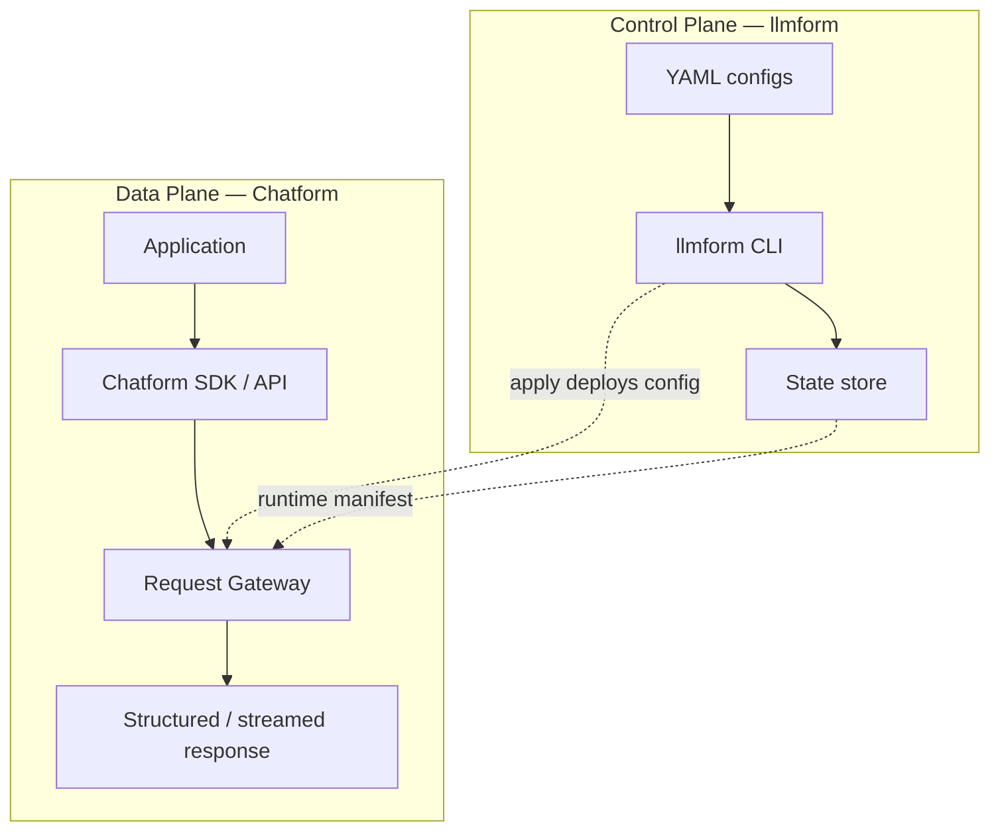
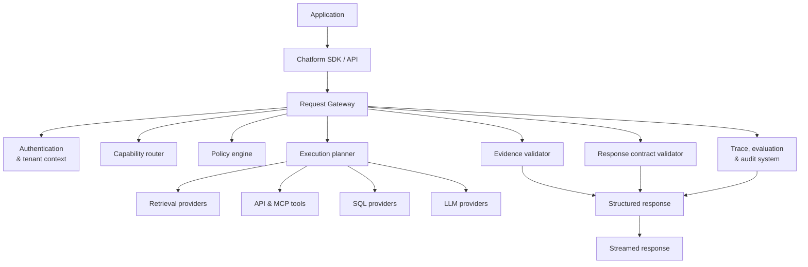
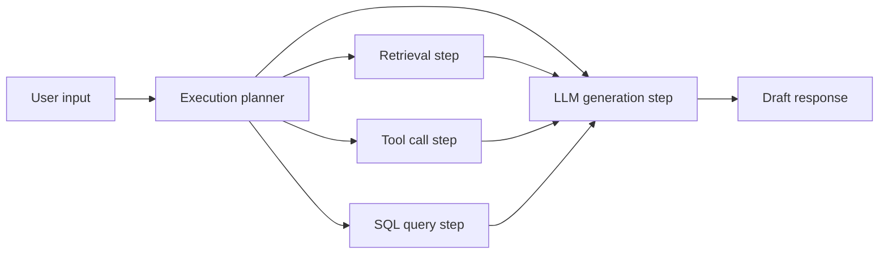
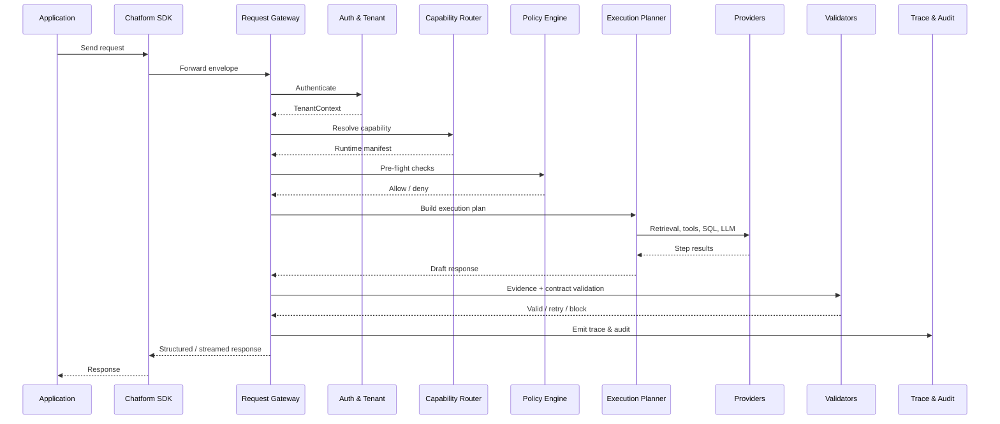

# Chatform Runtime Architecture

> **⚠️ SUPERSEDED — do not build from this document.**
> "Chatform" as a separate product was retired on 2026-08-23; the runtime folded into
> llmform as `internal/runtime`. The gateway stage chain described here survives, but
> policy is no longer a single pre-flight stage — it is a set of interception hooks
> invoked at every model and tool edge.
> **Current spec: [SPEC.md](./SPEC.md). Rationale: [DESIGN-REVIEW.md](./DESIGN-REVIEW.md).**

**Chatform** is the runtime layer that executes LLM requests. Applications call the Chatform SDK/API; the **Request Gateway** orchestrates auth, routing, policy, planning, execution, validation, and observability.

**llmform** (control plane) declares *what* should exist. **Chatform** (data plane) runs *how* each request is handled at runtime.

---

## End-to-End Stack



---

## Request Gateway Pipeline

This is the core runtime path for every request.

```
Application
    |
    v
Chatform SDK / API
    |
    v
Request Gateway
    |
    +--> Authentication and tenant context
    |
    +--> Capability router
    |
    +--> Policy engine
    |
    +--> Execution planner
    |       |
    |       +--> Retrieval providers
    |       +--> API and MCP tools
    |       +--> SQL providers
    |       +--> LLM providers
    |
    +--> Evidence validator
    |
    +--> Response contract validator
    |
    +--> Trace, evaluation and audit system
    |
    v
Structured response / streamed response
```



---

## Gateway Stages

### 1. Chatform SDK / API

The application-facing boundary. Accepts a **request envelope**:

```json
{
  "assistant": "support_bot",
  "tenant_id": "acme-corp",
  "input": { "message": "What's the price of plan Pro?" },
  "stream": true,
  "trace_id": "req_abc123"
}
```

Responsibilities:
- Stable HTTP/gRPC contract for apps
- Client-side retries, timeouts, streaming adapters
- Attaches correlation IDs before hitting the gateway

### 2. Authentication and tenant context

Runs first on every request.

| Concern | Behavior |
|---------|----------|
| Identity | Validate API keys, JWT, mTLS |
| Tenant | Resolve tenant → config namespace, quotas, feature flags |
| Authorization | Check caller can invoke the requested assistant/capability |
| Context | Build `TenantContext` passed to all downstream stages |

Output: authenticated `RequestContext` with tenant, user, scopes, and rate-limit bucket.

**llmform mapping:** `provider` blocks and per-assistant access rules deployed via `llmform apply`.

### 3. Capability router

Selects *which* assistant, workflow, or capability handles the request.

- Match by assistant ID, route header, or intent classifier
- Load the resolved **runtime manifest** for that capability (from llmform state)
- Fail fast if capability is disabled or not deployed

**llmform mapping:** `resource.assistant.*` — the router loads the composed graph (model, policies, tools, data sources).

### 4. Policy engine

Enforces rules *before* and *during* execution.

| Phase | Checks |
|-------|--------|
| Pre-flight | Input guardrails, topic blocks, PII detection, prompt injection |
| In-flight | Tool allowlists, SQL row-level rules, retrieval scope |
| Post-flight | Output guardrails (delegated partly to response validators) |

Policies are evaluated as a ordered rule set; first deny wins unless configured otherwise.

**llmform mapping:** `resource.policy.*`, `resource.guardrail.*`

### 5. Execution planner

Builds an **execution plan** — a DAG of steps to satisfy the request. This is *runtime* planning (per request), distinct from llmform's *infrastructure* plan (per deploy).



The planner decides:
- Which retrieval queries to run (and in parallel)
- Which tools the model may call
- Fallback model chain on provider errors
- Token budget allocation across steps

**llmform mapping:** wires available providers from config; planner reads the assistant's declared `data_sources`, `tools`, `model`.

#### Execution backends

| Backend | Role | llmform resource |
|---------|------|------------------|
| Retrieval providers | RAG, vector search, doc fetch | `data_source`, `knowledge_base` |
| API and MCP tools | External actions, function calling | `tool` |
| SQL providers | Structured data queries | `data_source` (type: sql) |
| LLM providers | Generation, reasoning | `model` |

### 6. Evidence validator

Ensures claims in the response are grounded in retrieved evidence or tool outputs.

- Citation required when policy demands it
- Detect unsupported factual statements vs. provided context
- Flag or block responses that hallucinate beyond evidence

**llmform mapping:** policy rules like `"Always cite your sources"` become validator constraints.

### 7. Response contract validator

Validates the response against a declared **output schema** or contract.

- JSON schema enforcement for structured outputs
- Required fields (answer, citations, confidence, next_actions)
- Streaming chunk assembly before final validation

**llmform mapping:** `assistant.output` block in config (future schema field).

### 8. Trace, evaluation and audit system

Observability and compliance layer — runs alongside all stages.

| Signal | Purpose |
|--------|---------|
| Trace spans | Latency per stage, provider calls, tool invocations |
| Evaluation hooks | Online quality scoring, regression detection |
| Audit log | Immutable record: who, what, which policies, which data accessed |

Emits to OpenTelemetry, structured logs, and optional eval pipelines.

---

## Request Lifecycle (sequence)



---

## Config → Runtime Mapping

| llmform resource | Gateway stage | Runtime behavior |
|------------------|---------------|------------------|
| `provider.*` | All stages | Credentials, endpoints for LLM/API/SQL backends |
| `policy.*` | Policy engine | Pre/in/post-flight rule evaluation |
| `guardrail.*` | Policy engine | Topic blocks, PII, injection detection |
| `model.*` | Execution planner → LLM | Model ID, params, fallback chain |
| `data_source.*` | Execution planner → Retrieval / SQL | Fetch context or run queries |
| `knowledge_base.*` | Execution planner → Retrieval | Vector search, chunk ranking |
| `tool.*` | Execution planner → API/MCP | Function schemas, allowlists |
| `assistant.*` | Capability router | Composed capability manifest |

After `llmform apply`, the gateway loads a **runtime manifest** (compiled from state) so hot paths avoid re-parsing YAML.

---

## Package Layout (runtime)

```
llmform/
├── cmd/
│   ├── llmform/              # Control plane CLI
│   └── chatform/             # Runtime server (future)
├── internal/
│   ├── gateway/
│   │   ├── gateway.go        # Request Gateway orchestrator
│   │   ├── auth/             # Authentication & tenant context
│   │   ├── router/           # Capability router
│   │   ├── policy/           # Policy engine
│   │   ├── execplan/         # Execution planner
│   │   ├── evidence/         # Evidence validator
│   │   ├── contract/         # Response contract validator
│   │   └── observability/    # Trace, eval, audit
│   └── provider/
│       ├── retrieval/
│       ├── tool/
│       ├── sql/
│       └── llm/
├── pkg/
│   └── chatform/             # Public SDK types & client
└── docs/
    ├── ARCHITECTURE.md       # Control plane (llmform)
    └── RUNTIME.md            # This document
```

---

## Design Principles

1. **Gateway as single front door** — all requests flow through one pipeline; no bypass paths
2. **Fail closed** — auth or policy failure rejects before any provider call
3. **Plan then execute** — execution planner builds a DAG; steps run in dependency order
4. **Ground before ship** — evidence validator runs before response leaves the gateway
5. **Everything traced** — every stage emits spans; audit log is append-only
6. **Config-driven behavior** — runtime reads compiled manifest from llmform state, not ad-hoc code

---

## Phased Roadmap (runtime)

### Phase R1 — Gateway skeleton
- [ ] Request envelope types (`pkg/chatform`)
- [ ] Gateway orchestrator with stage interfaces
- [ ] In-memory manifest loader (from example YAML)

### Phase R2 — Core path
- [ ] Auth stub + tenant context
- [ ] Capability router (assistant lookup)
- [ ] Policy engine (rule list evaluation)
- [ ] Execution planner + mock LLM provider

### Phase R3 — Providers & validation
- [ ] Retrieval, tool, SQL provider interfaces
- [ ] Evidence validator (citation checks)
- [ ] Response contract validator (JSON schema)
- [ ] OpenTelemetry trace + audit log

### Phase R4 — Production
- [ ] Streaming responses
- [ ] Rate limiting & quotas per tenant
- [ ] Hot reload of runtime manifest from llmform state
- [ ] Online eval hooks
